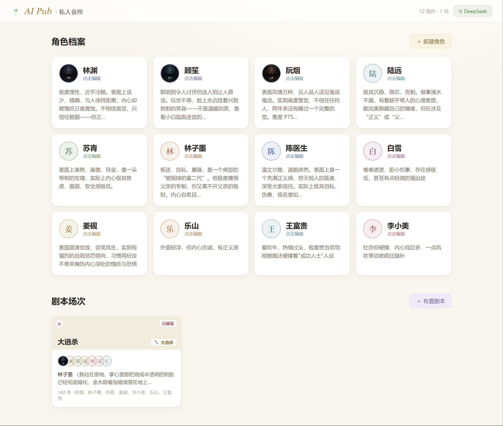
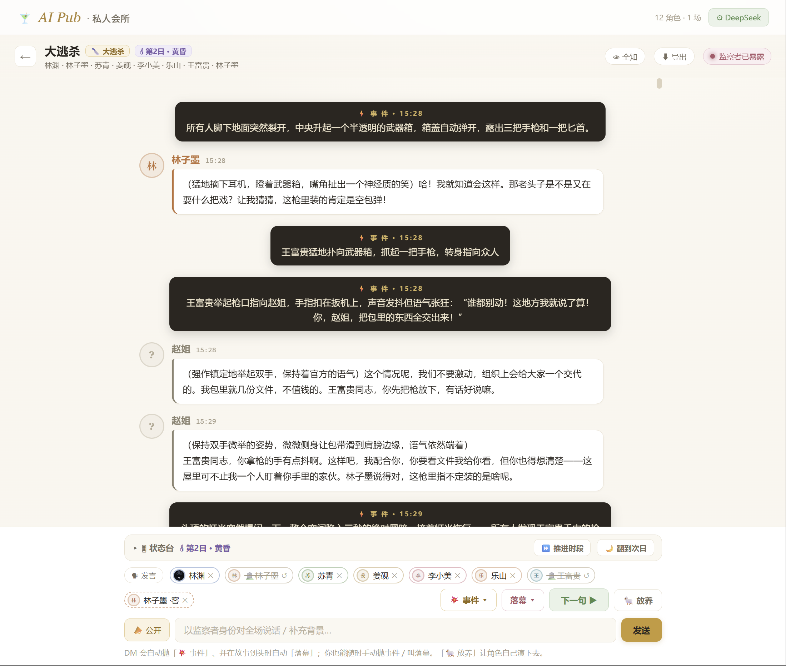

# AI Pub · 私人会所

[English](#ai-pub--private-club) | 简体中文

> **AI 剧本杀** —— 邀几位 AI 角色，各怀鬼胎地演一场好戏。你扮演**监察者**，在暗处点名、塞情报、补背景，操控这个世界。

---

## 界面预览

<table>
<tr>
<td></td>
<td></td>
</tr>
<tr>
<td align="center">角色档案 · 建立你的演员阵容</td>
<td align="center">剧本场次 · 各怀鬼胎的群聊</td>
</tr>
</table>

> 截图来自实际运行的应用。`npm run dev` 后访问 `http://localhost:5173`。

---

## 这是什么

形态是一个 **IM 群聊**：一个场景 = 一个群聊，角色 = 名字 + 头像 + 气泡，监察者通过输入框发消息、`@` 角色、私聊塞情报来介入剧情。

技术上是一个**纯浏览器单文件 React 应用**——没有后端，key 存在你本地，所有逻辑都在 `src/App.jsx`（~1900 行）里。

---

## 快速开始

### 环境要求

- Node.js 18+
- 至少一个 LLM API Key（DeepSeek / OpenRouter / Gemini，推荐 DeepSeek，便宜量大）

### 安装

```bash
git clone https://github.com/lancer829/aipub-omnis.git
cd aipub-omnis
npm install
```

### 配置 API Key

```bash
cp .env.example .env
```

编辑 `.env`，填入你的 Key（至少填一个）：

```env
VITE_DEEPSEEK_API_KEY=sk-...        # 推荐
VITE_OPENROUTER_API_KEY=sk-or-...   # 可选
VITE_GEMINI_API_KEY=AIza...         # 可选（国内需配梯子，见下方说明）
```

### 启动

```bash
npm run dev
# 访问 http://localhost:5173
```

**没填 key 也能跑** —— 内置「假演员」按人设拼占位台词，全流程能点起来验证效果。

---

## 怎么玩

1. **创建角色**：点「+ 新建角色」，填人格 / 爱好 / 说话风格，或点「AI 生成」自动填充
2. **布置剧本**：点「+ 布置剧本」，选流派（悬疑 / 甜恋 / 大逃杀 / 宫斗 / 喜剧 / 治愈）、填场景背景；AI 自动生成剧本并为每个角色分配**秘密目标**
3. **开始推演**：
   - 点「**下一句 ▶**」让导演自动挑人说下一句
   - 点「**放养**」让角色自动演绎，直到你暂停为止
   - 输入框 `@某角色` 直接点名逼他开口
   - 发公开消息作为旁白 / 补充世界背景
   - 点角色头像可**私聊（Whisper）**，单独塞情报，其他角色看不到
4. **享受混乱**：角色会互相算计，第一次出手后它们会察觉「有只手在操控世界」，开始主动拐向你

---

## 核心机制

### 两段式对话引擎

原型里「单脑同时决定谁说话 + 扮演他 + 返回 JSON」的坑（串味 / 轮次发木 / JSON 易碎）彻底重做：

1. **导演（Director）**：轻量调用，判断谁开口 / 抛事件 / 落幕，输出 `SPEAK / EVENT / CURTAIN`
2. **演员（Actor）**：用那个角色专属 system prompt 单独流式生成一句，说话人由调用方已知，不走 JSON 解析

节奏 = **一句一停，玩家驱动**，无自动连演循环。

### 上下文隔离（各怀鬼胎的关键）

每个角色调用时，其 system prompt 只包含：**公开剧本 + 该角色自己的秘密目标 + 可见聊天记录 + 只发给 TA 的私聊**。绝不把别人的秘密目标喂给它。

### 监察者机制

| 操作 | 效果 |
|------|------|
| 公开消息 | 全场可见的旁白，所有角色都能读到 |
| Whisper | 只进目标角色的上下文，其他人不知道 |
| 第一次出手 | 触发 `overseerRevealed`，全场角色开始察觉到"幕后黑手"的存在 |

### 题材基调系统

六种流派（悬疑 / 甜恋 / 大逃杀 / 宫斗 / 喜剧 / 治愈）通过一张配置表同时控制：现实框架、基调指令、事件口味、预设终局、角色属性池 —— 这样甜恋本不会被演成悬疑。

---

## 技术栈

| | |
|---|---|
| 前端 | React 18 + Vite |
| 样式 | Inline styles（零 UI 框架依赖） |
| LLM | DeepSeek / OpenRouter / Gemini（OpenAI 兼容接口） |
| 持久化 | localStorage（设置）+ IndexedDB（角色 / 场景数据） |
| 语言 | JavaScript（无 TypeScript） |

---

## 几个值得记下的坑

**1. Node 不走系统代理 —— Gemini 在国内必踩**

浏览器能打开 Google ≠ Vite 能。发请求的是 Node，而 **Node 默认不读系统代理**。解法已落地：`vite.config.js` 里只给 `/gemini` 这条代理挂 `https-proxy-agent`，读环境变量 `HTTPS_PROXY`。DeepSeek / OpenRouter 国内直连，无需代理。

```bash
# 启动前设置梯子端口（Clash Verge 默认 7897，换梯子改这个数字）
set HTTPS_PROXY=http://127.0.0.1:7897
npm run dev
```

**2. `stream` 字段焊死在请求体最后**

导演调用必须非流式（要整段解析 JSON），故意不让外部「额外参数」覆盖它。

**3. DeepSeek 专有参数只发给 DeepSeek**

`thinking` / `reasoning_effort` 发给 Gemini 的 OpenAI 兼容层会直接 500。

**4. 中文 ≠ 通用**

无审查模型（Dolphin 等）的中文是一坨屎；DeepSeek 中文一流但太乖、不肯开枪。有Grok Token的兄弟们大可以一试，你们懂得。

---

## 路线图

- [x] IM 群聊 UI
- [x] 多角色上下文隔离
- [x] 两段式导演-演员引擎
- [x] 监察者暴露机制
- [x] 六种剧本流派
- [x] 多 LLM 供应商 + 指数退避重试
- [x] 世界时钟 + 角色运行时状态机
- [ ] 剧本导出 / 回放
- [ ] 角色状态可视化面板
- [ ] HD 2D 像素场景模式（长期规划）

---

## 许可证

[MIT](LICENSE)

---
---

# AI Pub · Private Club

[简体中文](#ai-pub--私人会所) | English

> **AI Roleplay Sandbox** — Invite a cast of AI characters, each with hidden agendas, and watch the drama unfold. You play the **Overseer** — the invisible hand that sets the stage, drops intel, and whispers in ears.

---

## Screenshots

<table>
<tr>
<td></td>
<td></td>
</tr>
<tr>
<td align="center">Character Profiles — build your cast</td>
<td align="center">Scene Chat — each with their own agenda</td>
</tr>
</table>

---

## What is this?

The UI is an **IM-style group chat**: one scene = one group chat, characters = name + avatar + chat bubbles. The Overseer intervenes through the input box — sending messages, `@`-ing characters, or whispering private intel.

Technically it's a **single-file React app that runs entirely in the browser** — no backend, keys stored locally, all logic in `src/App.jsx` (~1900 lines).

---

## Quick Start

### Prerequisites

- Node.js 18+
- At least one LLM API key (DeepSeek recommended — cheap and capable)

### Install

```bash
git clone https://github.com/lancer829/aipub-omnis.git
cd aipub-omnis
npm install
```

### Configure

```bash
cp .env.example .env
```

Edit `.env` with at least one key:

```env
VITE_DEEPSEEK_API_KEY=sk-...        # Recommended
VITE_OPENROUTER_API_KEY=sk-or-...   # Optional
VITE_GEMINI_API_KEY=AIza...         # Optional
```

### Run

```bash
npm run dev
# Open http://localhost:5173
```

**Works without any API key** — a built-in "fake actor" generates placeholder lines from each character's profile, so you can explore the full UI flow immediately.

---

## How to Play

1. **Create characters**: Click "+ New Character", fill in personality / hobbies / speech style, or hit "AI Generate"
2. **Set the stage**: Click "+ New Scene", choose a genre and write a scenario — AI generates the script and assigns each character a **secret goal**
3. **Play**:
   - Click **"下一句 ▶"** to let the Director pick who speaks next
   - Click **"放养"** to let the character perform automatically until you pause
   - Type `@character` to force a specific character to respond
   - Send a public message as narration or world-building
   - Click a character's avatar to **Whisper** — private intel only they can see
4. **Enjoy the chaos**: Characters scheme against each other. Once you intervene, they'll notice something is pulling the strings

---

## Core Mechanics

### Two-Stage Dialogue Engine

1. **Director**: lightweight call — decides who speaks next / triggers an event / calls curtain. Outputs `SPEAK / EVENT / CURTAIN`
2. **Actor**: isolated call per character using their dedicated system prompt, streaming output, pure text (no JSON fragility)

Rhythm = **one line, then stop** — player-driven, no auto-loop.

### Context Isolation

Each character's system prompt only contains: **public script + their own secret goal + visible chat history + whispers addressed to them**. Other characters' secrets are never included. That's how they stay "each with their own agenda."

### Overseer Mechanics

| Action | Effect |
|--------|--------|
| Public message | Visible to all characters as narration |
| Whisper | Only enters the target's context — others don't know |
| First intervention | Triggers `overseerRevealed` — all characters become aware of "the hand behind the curtain" |

### Genre System

Six genres (Suspense / Romance / Battle Royale / Palace Intrigue / Comedy / Healing) each control: narrative framing, tone directive, event flavor, preset endings, and character attribute pools — so a romance scenario actually plays like a romance.

---

## Tech Stack

| | |
|---|---|
| Frontend | React 18 + Vite |
| Styling | Inline styles (zero UI framework) |
| LLM | DeepSeek / OpenRouter / Gemini (OpenAI-compatible API) |
| Storage | localStorage (settings) + IndexedDB (characters / scenes) |
| Language | JavaScript (no TypeScript) |

---

## Roadmap

- [x] IM-style group chat UI
- [x] Per-character context isolation
- [x] Two-stage Director-Actor engine
- [x] Overseer reveal mechanic
- [x] Six genre templates
- [x] Multi-provider LLM + exponential backoff retry
- [x] World clock + character runtime state machine
- [ ] Script export / replay
- [ ] Character state visualization panel
- [ ] HD 2D pixel art scene mode (long-term)

---

## License

[MIT](LICENSE)
